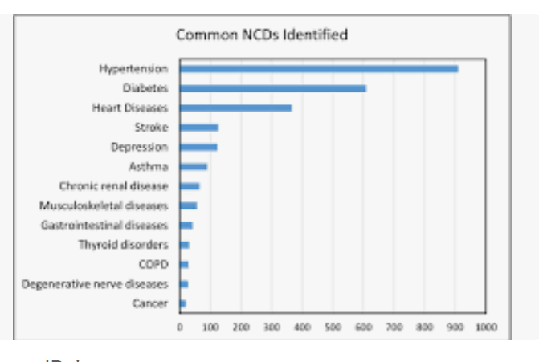
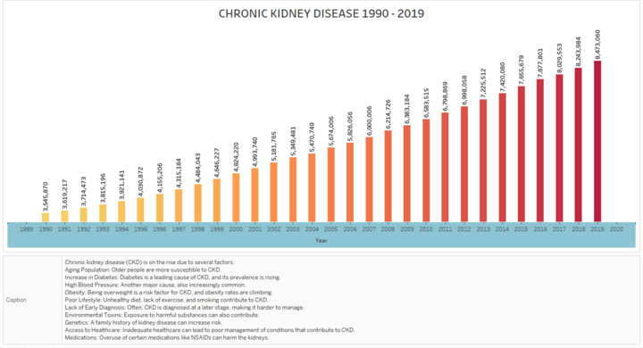

# PROJECT 3 US Chronic Diseases
See ReadMe section

## Topic
CDC's Division of Population Health provides a cross-cutting set of 115 indicators developed by consensus among CDC, the Council of State and Territorial Epidemiologists, and the National Association of Chronic Disease Directors. These indicators allow states and territories to uniformly define, collect, and report chronic disease data that are important to public health practice in their area. In addition to providing access to state-specific indicator data, the CDI web site serves as a gateway to additional information and data resources.

1. What are the most common chronic diseases in the USA? (Frenci)
    Create stratification category1 dataframe
    Pie chart, bar chart? (limitations based on chart)
2. Where are these diseases locationed (based on state)? dropdown list (user interaction)(Marah)
    Create data source dataframe
    Marker map (should understand locations better)
3. Heat map filtered by stratification? (Nathan)
    SQL database
    year start/year end dataframe 

## Dataset

https://catalog.data.gov/dataset/u-s-chronic-disease-indicators

## Project Inspiration & Initial Design

Data cleaning from project 2

## GitHub Link
https://github.com/Nathan-Savage/chronic_diseases_project

## Ethical Considerations
*Project submission only:* At least one paragraph summarizing efforts for ethical considerations made in the project

Based on surveys (creates limitations, potentially false data representation)

## Repository Structure
*Project submission only:* Instructions on how to use and interact with the project

